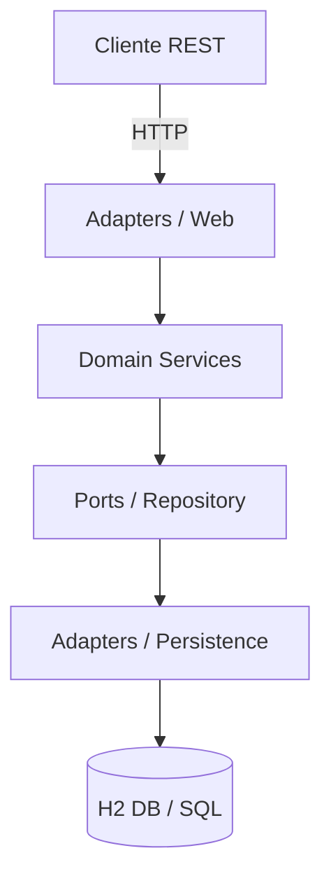
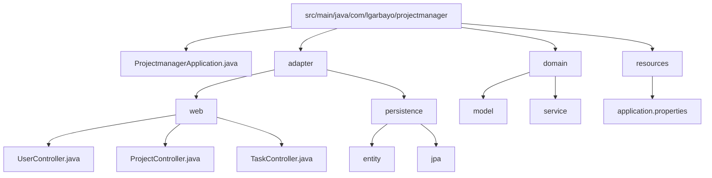

# Project Manager API Rest

API REST robusta construida con Spring Boot para la gestión integral de proyectos, tareas y usuarios. Permite la asignación de recursos, seguimiento de estados de tareas y gestión de dependencias entre entidades de negocio, optimizada para entornos de gestión de equipos.

---

## ✨ Características clave

* **Gestión de Entidades**: Control total sobre `User`, `Project` y `Task` con relaciones complejas.
* **Arquitectura Hexagonal**: Separación clara entre adaptadores de entrada/salida y la lógica de negocio central.
* **Validaciones de Negocio**: Control de estados de tareas, fechas de proyectos y consistencia en la asignación de usuarios.
* **Persistencia Flexible**: Configurado actualmente con H2 (en memoria) para desarrollo rápido, fácilmente extensible a bases de datos relacionales.
* **Manejo de Errores**: Sistema centralizado para capturar excepciones de dominio y devolver códigos de estado HTTP precisos.

---

## 🧱 Arquitectura



---

## 🗂️ Estructura del proyecto



---

## ⚙️ Requisitos previos

* Java 21.
* Maven 3.9+.
* IDE (IntelliJ IDEA, VS Code o Eclipse).

---

## 🚀 Puesta en marcha

### Ejecución Local con Maven

```bash
./mvnw clean package
./mvnw spring-boot:run

```

La aplicación estará disponible en: `http://localhost:8080`.
La consola de H2 se puede acceder en: `http://localhost:8080/h2-console` (si está habilitada).

---

## ⚙️ Configuración

Parámetros por defecto (`src/main/resources/application.properties`):

```properties
spring.application.name=projectmanager
spring.datasource.url=jdbc:h2:mem:projectdb
spring.datasource.driverClassName=org.h2.Driver
spring.datasource.username=sa
spring.datasource.password=
spring.jpa.database-platform=org.hibernate.dialect.H2Dialect
spring.h2.console.enabled=true

```

---

## 📡 API REST

| Método | Endpoint | Descripción |
| --- | --- | --- |
| GET | `/users` | Lista todos los usuarios |
| POST | `/users` | Crea un nuevo usuario |
| GET | `/projects` | Lista todos los proyectos |
| POST | `/projects` | Crea un nuevo proyecto |
| GET | `/projects/{id}` | Obtiene detalle de un proyecto |
| PUT | `/projects/{id}` | Actualiza datos de un proyecto |
| DELETE | `/projects/{id}` | Elimina un proyecto |
| GET | `/tasks` | Lista todas las tareas |
| POST | `/tasks` | Crea una tarea y la asigna a un proyecto |
| PATCH | `/tasks/{id}/status` | Cambia el estado de una tarea |

### Ejemplo de creación de Proyecto

**POST** `/projects`

```json
{
  "name": "Sistema de Gestión v2",
  "description": "Desarrollo del módulo de reportes",
  "startDate": "2024-02-01",
  "status": "ACTIVE"
}

```

---

## ✅ Reglas de negocio destacadas

* **Integridad de Proyectos**: No se puede eliminar un proyecto que tenga tareas activas con usuarios asignados.
* **Estados de Tarea**: Las tareas siguen un flujo lógico (TODO -> IN_PROGRESS -> DONE).
* **Validación de Fechas**: La fecha de finalización de una tarea no puede ser anterior a la fecha de inicio del proyecto.
* **Desacoplamiento**: El dominio no conoce las entidades JPA, utiliza mappers para transformar los datos en la capa de persistencia.

---

## 🙌 Contribuciones

1. Haz un **fork** del repositorio.
2. Crea una rama para tu mejora: `git checkout -b feature/nueva-mejora`.
3. Realiza tus cambios y asegúrate de que el código compila.
4. Envía un **Pull Request** detallando los cambios realizados.
