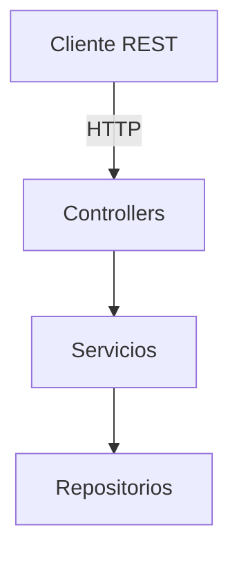
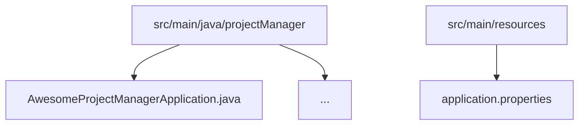

# 📌 Awesome Project Manager API

[](https://adoptium.net/)
[](https://spring.io/projects/spring-boot)
[](https://maven.apache.org/)

API REST construida con Spring Boot para gestionar proyectos, hitos y tareas, e incluir un endpoint de analisis que resume el avance de un proyecto. Este README se basa en la definicion del contrato v0.0.1.

---

## ✨ Caracteristicas clave

- **CRUD completo** para proyectos, hitos y tareas.
- **Analisis de avance** por proyecto con detalle por hitos y tareas.
- **Contratos claros**: comandos de alta/actualizacion separados de los recursos.
- **Estructura simple** lista para evolucionar hacia una arquitectura por capas.

---

## 🧱 Arquitectura



---

## 🗂️ Estructura del proyecto



---

## ⚙️ Requisitos previos

- Java 21 (Temurin recomendado).
- Maven 3.9+ o el wrapper `./mvnw`.

---

## 🚀 Puesta en marcha

### Opcion 1 · Local con Maven

```bash
./mvnw clean package
./mvnw spring-boot:run
```

La aplicacion escucha en `http://localhost:8080`.

---

## ⚙️ Configuracion

Parametros por defecto (`src/main/resources/application.properties`):

```properties
spring.application.name=awesomeProjectManager
```

---

## 📡 API REST

| Metodo | Endpoint                                      | Descripcion                     |
|--------|-----------------------------------------------|---------------------------------|
| GET    | /project                                      | Lista proyectos                 |
| POST   | /project                                      | Crea un proyecto                |
| GET    | /project/{projectUuid}                        | Recupera un proyecto            |
| PUT    | /project/{projectUuid}                        | Actualiza un proyecto           |
| DELETE | /project/{projectUuid}                        | Borra un proyecto               |
| GET    | /project/{projectUuid}/milestone              | Lista hitos                     |
| POST   | /project/{projectUuid}/milestone              | Anade un hito                   |
| GET    | /project/{projectUuid}/milestone/{milestoneUuid} | Recupera un hito                |
| PUT    | /project/{projectUuid}/milestone/{milestoneUuid} | Actualiza un hito               |
| DELETE | /project/{projectUuid}/milestone/{milestoneUuid} | Borra un hito                   |
| GET    | /project/{projectUuid}/task                   | Lista tareas                    |
| POST   | /project/{projectUuid}/task                   | Crea una tarea                  |
| GET    | /project/{projectUuid}/task/{taskUuid}        | Recupera una tarea              |
| PUT    | /project/{projectUuid}/task/{taskUuid}        | Actualiza una tarea             |
| DELETE | /project/{projectUuid}/task/{taskUuid}        | Borra una tarea                 |
| GET    | /project/{projectUuid}/analysis               | Analisis del proyecto           |

---

## 🧾 Modelos y comandos

```ts
export interface DateType {
  year: number; // YYYY
  month: number; // 0-11
  week: number; // 0-3
}

export interface Project {
  uuid: string;
  title: string;
  description?: string;
  startDate: DateType;
  endDate: DateType;
  additionalFields?: Record<string, string>;
}

export interface Milestone {
  uuid: string;
  projectUuid: string;
  title: string;
  date: DateType;
  description?: string;
}

export interface Task {
  uuid: string;
  projectUuid: string;
  title: string;
  description?: string;
  durationWeeks: number;
  startDate: DateType;
}

export interface UpsertProjectCommand {
  title: string;
  description?: string;
  startDate: DateType;
  endDate: DateType;
  additionalFields?: Record<string, string>;
}

export interface UpsertMilestoneCommand {
  title: string;
  date: DateType;
  description?: string;
}

export interface UpsertTaskCommand {
  title: string;
  description?: string;
  durationWeeks: number;
  startDate: DateType;
}
```

---

## ✅ Ejemplo de creacion de proyecto

POST /project
Content-Type: application/json

```json
{
  "title": "Lanzamiento Q4",
  "description": "Plan de entrega de producto",
  "startDate": { "year": 2025, "month": 9, "week": 0 },
  "endDate": { "year": 2025, "month": 11, "week": 2 },
  "additionalFields": {
    "owner": "equipo-producto",
    "priority": "alta"
  }
}
```

---

## ❗ Formato de error

```ts
export interface Error {
  type: string;
  description: string;
}
```

---

## 🙌 Contribuciones

1. Haz un fork del repositorio.
2. Crea una rama feature: `git checkout -b feature/nueva-funcionalidad` que cuelgue de la rama develop.
3. Asegurate de pasar los tests y respeta el estilo del proyecto.
4. Envia un pull request explicando claramente el cambio.
